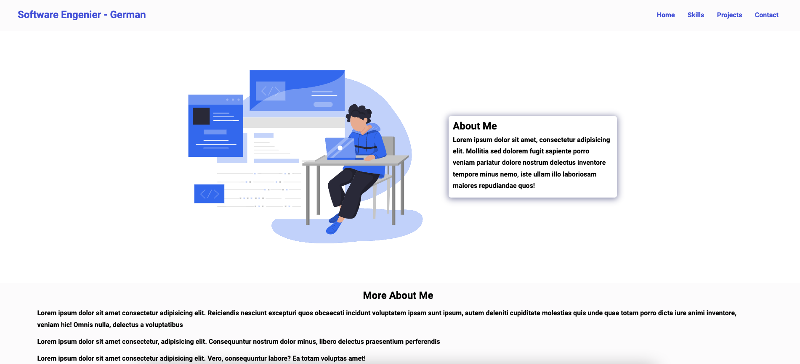

# EJEMPLO DE ESTRUCTURA DE CARPETAS PARA ALUMNOS DE CODO A CODO

Es un ejemplo de un portfolio

## Autor

German

## Github repo

Este es el repositorio [link](https://github.com/codoacodo-22539/ejemplo-tpo.git) 

## Sitio Web

El demo esta en el siguiente link [link]()

## Tech Stack

**Client:** HTML, CSS, Vanilla JavaSCript

## Tools Utilizadas

- [Ion Icons](https://ionic.io/ionicons) para el hambuger menu bar
- [Icon8](https://icons8.com/) para los skills icons

## Estructura de carpeta

El index.html and readme son los archivos en el root folder y tambien incluyen en un screenshot y un archivo readme.

La carpeta assets contiene css styles, icons, imagenes y los scripts.

La carpeta pages contiene los htmls de las paginas.